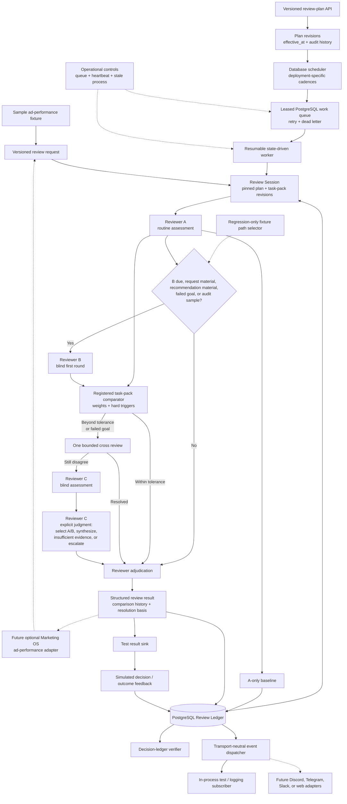

# Conclave MVP Project Architecture

## Status

Active architecture for the independent Conclave MVP. Foundation phases 1A and
1B and the transport-neutral event boundary are implemented and verified
against the dedicated Conclave Supabase project. Phase 2 task-pack intake and
automatic comparator routing are implemented. The accepted Phase 2 hardening
adds immutable task-pack pinning, explicit reviewer-C judgments, resumable
execution, route reconstruction, and non-local caller authentication. Migration
`20260726_0008` and the PostgreSQL acceptance cases are verified against the
dedicated Conclave Supabase project.

The normal worker infers the path from request materiality, reviewer-A
recommendation materiality, schedule and prior-outcome triggers, A/B distance,
merge compatibility, and hard conflicts. The fixture harness may still select
a known path so every protocol transition remains independently testable.

Marketing OS is built separately and has no Conclave dependency.

## Architecture Decision

Build Conclave as a modular monolith:

- one repository
- one application package
- one PostgreSQL review ledger
- one typed event stream and outbox built from that same ledger
- one API process
- separate persistent scheduler and worker commands from the same package
- versioned, deployment-editable review plans
- reviewer A as routine reviewer, B as cadence- and trigger-based auditor, and C
  as a two-stage judge
- provider adapters behind `ReviewerRuntime`
- a local fixture API plus scoped bearer authentication for any non-local mode

Conclave has no campaign builder, Meta adapter, account or Page discovery,
first-party event collector, spend approval, Telegram approval adapter,
Marketing policy engine, platform execution path, authoritative Marketing
decision record, Marketing outcome store, or Marketing Learning Registry.

## Ownership Boundary

### A future Marketing connection leaves Marketing OS responsible for

- canonical campaign and performance data
- Meta and other platform connectors and credentials
- raw provider responses and normalized snapshots
- advertising evidence preparation and redaction
- deterministic tracking-health and evidence-quality classification
- campaign-specific materiality
- advertising action and experiment ontology
- marketing policy and human approval
- Telegram and dashboard communications
- manual-action and execution records
- outcome metrics and Marketing Learning Registry

This is a future boundary, not a current integration requirement. Marketing OS
may be completed and operated without Conclave. The first intended real
Conclave deployment is limited to optional ad-performance review after
Marketing OS is already operating with reliable campaign results.

### Conclave owns

- review plans and sessions
- immutable copies of submitted evidence packages
- reviewer/provider routing
- first-round independence
- claims and assessments
- comparison and disagreement measurement
- one bounded cross-review round
- reviewer-C tie-breaking
- reviewer adjudication
- structured review results
- review audit history
- optional external feedback references for reviewer evaluation

## System Flow

The editable Mermaid source is
[`MVP_architecture_flow.mmd`](MVP_architecture_flow.mmd).



## Draft Future Integration Contracts

The request, result, and feedback contracts are currently local Conclave design
artifacts exercised with fixtures. They describe a possible future caller
boundary. They are not required by Marketing OS and do not block Marketing OS
development.

### `review-request/v1`

The caller supplies:

- caller and subject identifiers
- evidence version, idempotency key, and plan-occurrence trigger
- evidence, context, policy, goal, and quality sections
- observed time, metric period, attribution window, and freshness
- partial-data and tracking-health status
- data-classification and redaction declaration
- allowed recommendation and experiment schemas
- domain materiality indicators
- task-pack and action-ontology references
- weighted comparator profile, tolerance, and hard-conflict triggers
- review-plan ID and revision

Conclave validates, hashes, and stores the package before any reviewer call. It
does not fetch or enrich domain evidence.

### `review-result/v1`

Conclave returns:

- review session, request, and snapshot identifiers
- result status
- structured recommendation
- claims and evidence references
- agreements and disagreements
- baseline, cross-review, and tie-breaker metadata
- evidence quality and reviewer confidence as separate fields
- missing evidence and alternative explanations
- risk and urgency
- caller-decision-required status
- provider, model, prompt, schema, token, cost, and timing metadata

### `review-feedback/v1`

The caller may return:

- opaque decision reference
- opaque manual-action or execution reference
- opaque outcome reference
- outcome classification
- confounders and evidence quality
- evaluation time

Conclave uses feedback to evaluate reviewer performance. The caller remains
authoritative for the underlying records and all domain learning.

## Versioned Review Plans

Cadence values are configuration for each deployment, not constants in the
kernel.

```yaml
review_plan:
  id: sample-ad-performance-oversight
  revision: 4
  effective_at: 2026-07-18T00:00:00Z
  timezone: America/Los_Angeles
  evidence_delivery: fixture_replay

  slots:
    A:
      cadence: PT4H
      anchor_at: 2026-07-18T00:00:00Z
    B:
      cadence: PT16H
      anchor_at: 2026-07-18T00:00:00Z
    C:
      cadence: event_only

  panel_expansion:
    invoke_b_on_request_material: true
    invoke_b_on_recommendation_material: true
    invoke_b_on_failed_goal: true
    nonmaterial_audit_sample_rate: 0.10

  collision_policy: shared_session
  cross_review_rounds: 1
```

The four- and sixteen-hour intervals are ad-performance test defaults only. Any
deployment may use different validated values.

Plan changes create a new revision with a future `effective_at`. Open sessions
stay pinned to their original revision. Future sessions use the new revision.
Rollback creates another revision; historical revisions are never mutated.

The independent MVP uses fixture replay. A due review executes against the
sample package assigned to that plan occurrence. Conclave does not query
Marketing or any production system. A future adapter may use caller-push
delivery, but only after separate approval.

Reviewer A runs for every due eligible occurrence. Reviewer B joins when:

- B's independently configured cadence is due;
- the caller-declared request is material and the plan enables that trigger;
- A proposes a deterministically material recommendation and the plan enables
  that trigger;
- outcome feedback says a prior change failed to move the goal; or
- the occurrence is selected by the configured audit sample.

When B joins, it uses A's exact snapshot. A triggered B invocation never moves
B's next scheduled audit. Both independent calls have empty prior-claim and
peer-assessment fields. Reviewer B has a separate versioned role and prompt,
and the production adapter rejects any independent call containing another
reviewer's content. Reviewer C has no cadence.

## Fixed MVP State Machine

```text
requested
    |
validated
    |
snapshotted
    |
reviewer_a
    |
baseline_recorded
    |
    +--> A-only + allowed non-material --> reviewer_adjudication
    |
reviewer_b                         (cadence or trigger)
    |
comparing
    |
    +--> within_tolerance --------------------------+
    |                                               |
cross_review                                        |
    |                                               |
    +--> resolved ----------------------------------+
    |                                               |
reviewer_c_independent                              |
    |                                               |
reviewer_c_judging                                  |
    |                                               |
reviewer_adjudication <-----------------------------+
    |
    +--> auto_resolved
    |
    +--> caller_decision_required
    |
result_returned
    |
feedback_pending
    |
evaluated
```

Explicit terminal or retryable failure states:

- `invalid_request`
- `stale_or_ineligible_evidence`
- `reviewer_a_failed`
- `reviewer_b_failed`
- `reviewer_c_failed`
- `awaiting_evidence`
- `result_delivery_failed`
- `cancelled`

Retries reuse the same snapshot and reviewer assignment and cannot duplicate
completed work.

## Runtime Processes

### API

- accept local idempotent fixture requests in development and test
- require scoped bearer credentials and caller ownership in non-local mode
- expose review status and complete review records
- deliver or expose structured results
- accept opaque caller feedback
- expose health and readiness

### Scheduler/Worker

- identify reviewer A and B work due under the approved plan
- apply plan revisions at their `effective_at` boundaries
- create idempotent sessions pinned to immutable plan and task-pack revisions
- claim due work with a PostgreSQL lease and `SKIP LOCKED`
- retry recoverable failures and dead-letter permanent or exhausted work
- support operator retry and cancellation
- record process start, heartbeat, stop, and stale-process status
- validate request eligibility
- execute reviewer A and record its baseline
- expand to blind reviewer B on cadence or configured triggers
- record reviewer-A baseline
- compare assessments
- run bounded cross review
- invoke reviewer C's independent and judging stages when required
- adjudicate reviewer disagreement
- deliver structured results
- evaluate caller feedback against reviewer performance
- resume from every legal partial state without repeating completed reviewer
  work or durable comparison decisions

## Application Modules

```text
.
├── src/conclave/
│   ├── api/                    # scoped API, results, audit, operations
│   ├── auditing/               # decision-ledger verification
│   ├── contracts/              # request/result/feedback schema validation
│   ├── events/                 # typed envelopes and publisher boundary
│   ├── ledger/                 # PostgreSQL records, queue, event outbox
│   ├── orchestration/          # fixed state machine and result construction
│   ├── plans/                  # versioned plans and schedule calculation
│   ├── reviewers/              # runtime, prompts, factory, provider adapters
│   ├── runtime/                # persistent scheduler and worker loops
│   ├── scheduling/             # occurrence expansion and leased work
│   ├── task_packs/             # registered ontology, eligibility, comparator
│   ├── config.py
│   └── database.py
├── migrations/
├── tests/
├── design-fixtures/
├── hyperstructure-review-contracts/
└── pyproject.toml
```

These are modules, not microservices. Feedback and external delivery modules
should be added only when their phases begin.

## Component Responsibilities

### Review Orchestrator

- loads the approved plan
- validates and reuses the immutable snapshot
- calls reviewer A and records its baseline
- expands the session to blind reviewer B on cadence or configured triggers
- records the A-only baseline
- compares structured claims against configured tolerance
- performs one bounded cross review
- invokes reviewer C's blind assessment and judging stage for surviving
  disagreement
- produces one structured result
- never calls a platform or communication channel

### Reviewer Runtime

```text
review(snapshot, role, round, prior_claims, prompt_version, schema_version)
    -> validated assessment + safe provider-attempt telemetry
```

The runtime is selected explicitly as `fixture` or `openai`. Non-local
deployments cannot start with the fixture runtime, and provider names never
fall back silently. The first production adapter uses OpenAI Responses for
reviewers A and B with `store=false`, no tools, strict JSON Schema output,
separate versioned evidence-only prompts, and no external memory or browsing.
Only the blind independent stage is approved on this adapter. Cross review and
Reviewer C are rejected before any provider request until their prompts are
separately reviewed.

The Phase 4A live gate intentionally used the same OpenAI model in both slots
to verify the common rail. This is not evidence of multi-model benefit.
Because provider, model, reviewer type, role, and prompt are configured per
slot, a later deployment can put a different model provider or a non-model
checker in B without changing orchestration or comparison logic.

Each plan slot carries an editable provider policy. The initial approved limits
are two attempts, 90 seconds per attempt, 30,000 input characters, 4,000 output
tokens, a $0.15 call ceiling, and a versioned pricing configuration. Only typed
transient provider failures retry. Invalid structured output and permanent
provider failures stop immediately.

The runtime returns a validated assessment plus safe attempt metadata. The
ledger stores request and response IDs, token counts, reasoning-token counts,
latency, cost, finish status, error category, and pricing version. It never
stores raw provider responses, hidden reasoning, or credentials.

Before task-pack validation and persistence, Conclave replaces model-supplied
materiality, tracking health, optimization eligibility, and primary conversion
with deterministic values from the pinned task pack and immutable snapshot.
These fields are identified as deterministic in the completion event. The
model supplies the recommendation; it does not define the policy facts used to
route that recommendation.

Reviewer C uses two different output contracts. The first invocation has no A/B
content and returns a normal assessment. The second receives C's stored
assessment plus A/B final claims and returns an explicit judgment:
`select_a`, `select_b`, `synthesize`, `insufficient_evidence`, or `escalate`.
Selecting A or B preserves that exact final assessment. Any synthesis, safe
fallback, or escalation must supply an explicit assessment that validates
against the pinned task pack. There is no inferred verdict.

### Comparator

The sample ad-performance task pack starts with these normalized weights:

| Dimension | Weight |
|---|---:|
| recommendation disposition | 0.22 |
| action type and direction | 0.22 |
| target and scope | 0.14 |
| expected goal impact | 0.12 |
| evidence sufficiency and quality | 0.10 |
| magnitude or exposure | 0.08 |
| risk and materiality | 0.07 |
| urgency and timing | 0.05 |

Each dimension produces a distance from `0` to `1`; the weighted sum is compared
with an initial ad-performance tolerance of `0.25`.

The following bypass weighting and force cross review:

- tracking-health disagreement;
- goal or primary-conversion disagreement;
- opposing action direction;
- incompatible target scope;
- evidence-eligibility disagreement;
- action outside the supplied ontology; or
- failed goal movement reported through caller feedback.

When category, action, target, and direction match within tolerance, the
deterministic merge keeps the more conservative exposure, higher risk, lower
evidence-quality reading, and earlier safe review time. Different categories,
targets, or directions are never silently averaged.

The kernel owns the comparison mechanism and disagreement workflow. The caller
owns the domain semantics and permitted ontology.

### Reviewer Adjudication

The MVP auto-resolves only when every condition below is true:

- the pinned review-plan revision explicitly allows auto-resolution;
- the result is non-material and low risk;
- no hard trigger fired and reviewer C was not invoked;
- the category is `observe` or `collect_more_data`;
- no operational action is proposed; and
- the result is either A-only or A/B agreement within tolerance.

Every other valid result is returned as `caller_decision_required`. Conclave
does not convert that status into an action.

### Feedback Evaluator

Links simulated feedback, or future opaque caller references, to the original
review and baseline. It evaluates reviewer performance but cannot reinterpret a
caller's metrics or create trusted domain knowledge.

The MVP reports panel-delta rate, caller preference when supplied, additional
issue catches, cross-review resolution rate, reviewer-C rate, caller override
rate, latency, and cost. These are panel-value indicators, not causal proof that
the panel outperformed reviewer A.

## Persistence

Implemented through migrations `20260726_0006`, `20260726_0007`,
`20260726_0008`, and `20260727_0009`:

- `review_plans`
- `review_plan_revisions`
- `reviewer_slots`
- `review_occurrences`
- `scheduler_work_items`
- `review_sessions`
- `reviewer_invocations`
- `reviewer_provider_attempts`
- `request_snapshots`
- `review_results`
- `runtime_processes`
- `audit_events`
- `event_streams`
- `event_subscriptions`
- `event_deliveries`
- `task_pack_revisions`

`audit_events` remains the one canonical event history. Migration
`20260726_0007` adds the public typed envelope and uses `event_streams` for
atomic sequence allocation. Subscriber delivery is tracked separately in
`event_deliveries`; a delivery failure never changes the committed review or
event.

Migration `20260727_0009` adds immutable provider-attempt records and aggregate
telemetry on each reviewer invocation. Provider attempts emit safe typed
events after the call. The event contains status and accounting metadata, not
the submitted snapshot or raw provider output.

Delivery is at least once and ordered per stream. Consumers deduplicate by the
stable `event_id`. The exact transport extension point is
`EventPublisher.publish(DomainEvent)`. Discord, Telegram, Slack, webhooks, and
other presentation adapters are not implemented.

See [Domain Event Stream and Future Adapter Boundary](EVENT_STREAM.md) for the
event contract, ordering, retry, privacy, and adapter rules.

Assessments, claims, baselines, disagreement, tie-break metadata, and the final
recommendation are stored as validated structured documents in invocations and
results for the MVP. Each new review session stores the content hash of the
immutable task-pack revision used for eligibility, materiality, comparison, and
result validation. Separate query-oriented tables should be added only when a
proven access pattern requires them.

Deferred persistence includes external feedback references, reviewer
evaluation candidates, and result-delivery attempts.

Important constraints:

- one session per caller, occurrence ID, evidence version, and plan revision
- one immutable task-pack content hash per new session
- one invocation per session, reviewer slot, stage, and round
- immutable snapshot content after hashing
- one assessment per reviewer slot, snapshot, and round
- no A/B reviewer sees the other's content before its first round is stored
- baseline recorded before comparison
- reviewer C only after surviving cross review
- one canonical result per review run
- append-only corrections and feedback references

## Minimal API

Implemented local fixture endpoints:

- `POST /reviews` — create an idempotent review
- `GET /reviews/{review_session_id}` — inspect a review
- `POST /reviews/{review_session_id}/run-auto` — run the registered task-pack
  route
- `POST /reviews/{review_session_id}/run` — run an explicit regression fixture
  path
- `GET /reviews/{review_session_id}/result` — retrieve the structured result
- `GET /reviews/{review_session_id}/audit` — verify the decision ledger
- `GET /review-sessions/{review_session_id}/events` — read typed events after a
  stream-sequence cursor
- `POST /scheduler/tick` — expand fixture schedules
- `POST /worker/run-once` — process one fixture work item
- `GET /operations/status` — inspect queue, process, and provider-attempt
  health, including tokens, cost, average latency, and latest completion
- `POST /operations/work-items/{work_item_id}/retry` — recover dead-letter work
- `POST /operations/work-items/{work_item_id}/cancel` — cancel unfinished work
- `GET /health`
- `GET /ready`

Local fixture mode is development-only and does not require a credential.
Every non-local mode fails startup unless scoped static bearer credentials are
configured. Reads are restricted to the owning caller; operational endpoints
require the `operations:manage` scope. Plan-management endpoints, external
feedback, and result-delivery endpoints are later-phase work.

## Security and Reliability

- no platform or domain-production credentials
- authenticated caller identities before any non-local deployment
- least-privilege caller scopes and caller ownership checks
- caller-declared classification plus Conclave validation
- redacted snapshots before provider calls
- secrets outside source control
- prompt and schema versioning
- strict structured-output validation
- no silent reviewer substitution
- database-backed idempotency and locking
- immutable review records and append-only corrections
- configurable retention and deletion of submitted evidence packages
- no private chain-of-thought storage
- subscriber failures isolated from committed review transactions

## Recommended Stack

- Python 3.12
- FastAPI
- Pydantic v2
- PostgreSQL
- SQLAlchemy
- Alembic
- provider SDKs behind `ReviewerRuntime`
- structured logs and operational metrics

Redis, Celery, Kafka, Kubernetes, a vector database, microservices, and a
generalized workflow DSL are not required for the MVP.

## Approval Decisions

| Decision | Recommendation |
|---|---|
| Architecture | Modular monolith |
| Database | PostgreSQL review ledger |
| Event boundary | Typed `audit_events` stream with PostgreSQL delivery checkpoints |
| Future communications | Transport adapters implement `EventPublisher` |
| Current input | Sample fixtures |
| Future caller boundary | Draft request/result/feedback contracts |
| Platform access | None |
| Communications | Owned by caller |
| Schedule | Versioned and editable per deployment |
| Reviewer panel | A routine; B cadence/trigger audit; C two-stage judge |
| Cross review | One bounded round |
| Ad-performance comparator | Weighted profile at tolerance 0.25 plus hard triggers |
| Operational decision | Owned by caller |
| Domain outcomes and learning | Owned by caller |
| Reviewer evaluation | Conclave, using opaque feedback references |

Project decisions still required:

- exact reviewer assignments and stances
- cost and timeout ceilings
- submitted-evidence retention
- production identity-provider choice beyond the MVP static bearer boundary
- result-delivery mode
- future caller acceptance of a contract version, only if an integration is
  later approved

These choices did not block the completed fixture foundation. Provider,
security, retention, and integration choices must be resolved before their
corresponding later phase begins.
