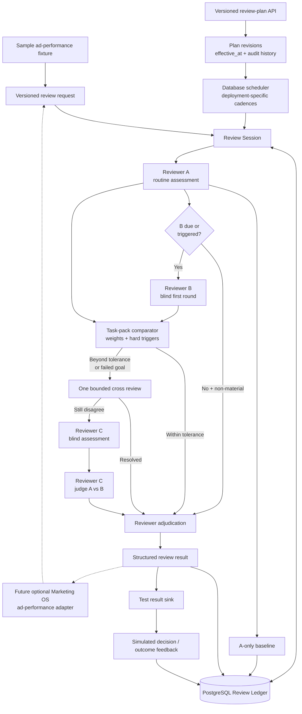

# Conclave MVP Project Architecture

## Status

Proposed architecture for an independent Conclave MVP. It is built and tested
with sample data and fixtures. Marketing OS is built separately and has no
Conclave dependency.

## Architecture Decision

Build Conclave as a modular monolith:

- one repository
- one application package
- one PostgreSQL review ledger
- one API process
- one scheduler/worker process from the same package
- versioned, deployment-editable review plans
- reviewer A as routine reviewer, B as cadence- and trigger-based auditor, and C
  as a two-stage judge
- provider adapters behind `ReviewerRuntime`
- authenticated review-request, result, and feedback APIs

Conclave has no campaign builder, Meta adapter, account or Page discovery,
first-party event collector, spend approval, Telegram approval adapter,
Marketing policy engine, platform execution path, authoritative Marketing
decision record, Marketing outcome store, or Marketing Learning Registry.

## Ownership Boundary

### A future Marketing connection leaves Marketing OS responsible for

- canonical campaign and performance data
- Meta and other platform connectors and credentials
- raw provider responses and normalized snapshots
- advertising evidence preparation and redaction
- deterministic tracking-health and evidence-quality classification
- campaign-specific materiality
- advertising action and experiment ontology
- marketing policy and human approval
- Telegram and dashboard communications
- manual-action and execution records
- outcome metrics and Marketing Learning Registry

This is a future boundary, not a current integration requirement. Marketing OS
may be completed and operated without Conclave. The first intended real
Conclave deployment is limited to optional ad-performance review after
Marketing OS is already operating with reliable campaign results.

### Conclave owns

- review plans and sessions
- immutable copies of submitted evidence packages
- reviewer/provider routing
- first-round independence
- claims and assessments
- comparison and disagreement measurement
- one bounded cross-review round
- reviewer-C tie-breaking
- reviewer adjudication
- structured review results
- review audit history
- optional external feedback references for reviewer evaluation

## System Flow

The editable Mermaid source is
[`MVP_architecture_flow.mmd`](MVP_architecture_flow.mmd).



## Draft Future Integration Contracts

The request, result, and feedback contracts are currently local Conclave design
artifacts exercised with fixtures. They describe a possible future caller
boundary. They are not required by Marketing OS and do not block Marketing OS
development.

### `review-request/v1`

The caller supplies:

- caller and subject identifiers
- evidence version, idempotency key, and plan-occurrence trigger
- evidence, context, policy, goal, and quality sections
- observed time, metric period, attribution window, and freshness
- partial-data and tracking-health status
- data-classification and redaction declaration
- allowed recommendation and experiment schemas
- domain materiality indicators
- task-pack and action-ontology references
- weighted comparator profile, tolerance, and hard-conflict triggers
- review-plan ID and revision

Conclave validates, hashes, and stores the package before any reviewer call. It
does not fetch or enrich domain evidence.

### `review-result/v1`

Conclave returns:

- review session, request, and snapshot identifiers
- result status
- structured recommendation
- claims and evidence references
- agreements and disagreements
- baseline, cross-review, and tie-breaker metadata
- evidence quality and reviewer confidence as separate fields
- missing evidence and alternative explanations
- risk and urgency
- caller-decision-required status
- provider, model, prompt, schema, token, cost, and timing metadata

### `review-feedback/v1`

The caller may return:

- opaque decision reference
- opaque manual-action or execution reference
- opaque outcome reference
- outcome classification
- confounders and evidence quality
- evaluation time

Conclave uses feedback to evaluate reviewer performance. The caller remains
authoritative for the underlying records and all domain learning.

## Versioned Review Plans

Cadence values are configuration for each deployment, not constants in the
kernel.

```yaml
review_plan:
  id: sample-ad-performance-oversight
  revision: 4
  effective_at: 2026-07-18T00:00:00Z
  timezone: America/Los_Angeles
  evidence_delivery: fixture_replay

  slots:
    A:
      cadence: PT4H
      anchor_at: 2026-07-18T00:00:00Z
    B:
      cadence: PT16H
      anchor_at: 2026-07-18T00:00:00Z
    C:
      cadence: event_only

  panel_expansion:
    invoke_b_on_a_material: true
    invoke_b_on_failed_goal: true
    nonmaterial_audit_sample_rate: 0.10

  collision_policy: shared_session
  cross_review_rounds: 1
```

The four- and sixteen-hour intervals are ad-performance test defaults only. Any
deployment may use different validated values.

Plan changes create a new revision with a future `effective_at`. Open sessions
stay pinned to their original revision. Future sessions use the new revision.
Rollback creates another revision; historical revisions are never mutated.

The independent MVP uses fixture replay. A due review executes against the
sample package assigned to that plan occurrence. Conclave does not query
Marketing or any production system. A future adapter may use caller-push
delivery, but only after separate approval.

Reviewer A runs for every due eligible occurrence. Reviewer B joins when:

- B's independently configured cadence is due;
- A proposes a material result;
- outcome feedback says a prior change failed to move the goal; or
- the occurrence is selected by the configured audit sample.

When B joins, it uses A's exact snapshot. A triggered B invocation never moves
B's next scheduled audit. Reviewer C has no cadence.

## Fixed MVP State Machine

```text
requested
    |
validated
    |
snapshotted
    |
reviewer_a
    |
baseline_recorded
    |
    +--> A-only + allowed non-material --> reviewer_adjudication
    |
reviewer_b                         (cadence or trigger)
    |
comparing
    |
    +--> within_tolerance --------------------------+
    |                                               |
cross_review                                        |
    |                                               |
    +--> resolved ----------------------------------+
    |                                               |
reviewer_c_independent                              |
    |                                               |
reviewer_c_judging                                  |
    |                                               |
reviewer_adjudication <-----------------------------+
    |
    +--> auto_resolved
    |
    +--> caller_decision_required
    |
result_returned
    |
feedback_pending
    |
evaluated
```

Explicit terminal or retryable failure states:

- `invalid_request`
- `stale_or_ineligible_evidence`
- `reviewer_a_failed`
- `reviewer_b_failed`
- `reviewer_c_failed`
- `awaiting_evidence`
- `result_delivery_failed`
- `cancelled`

Retries reuse the same snapshot and reviewer assignment and cannot duplicate
completed work.

## Runtime Processes

### API

- accept authenticated, idempotent review requests
- expose review status and complete review records
- deliver or expose structured results
- accept opaque caller feedback
- expose health and readiness

### Scheduler/Worker

- identify reviewer A and B work due under the approved plan
- apply plan revisions at their `effective_at` boundaries
- create idempotent sessions and reviewer invocations
- validate request eligibility
- execute reviewer A and record its baseline
- expand to blind reviewer B on cadence or configured triggers
- record reviewer-A baseline
- compare assessments
- run bounded cross review
- invoke reviewer C's independent and judging stages when required
- adjudicate reviewer disagreement
- deliver structured results
- evaluate caller feedback against reviewer performance
- retry recoverable failures

## Application Modules

```text
conclave/
├── app/
│   ├── api/                    # requests, results, feedback, health
│   ├── config/                 # environment configuration
│   ├── plans/                  # versioned review plans and effective revisions
│   ├── contracts/              # request/result/feedback protocols
│   ├── task_packs/             # registered domain schemas and comparator profiles
│   ├── orchestration/          # fixed review state machine
│   ├── scheduling/             # cadences and database locking
│   ├── ledger/                 # persistence and audit events
│   ├── reviewers/              # ReviewerRuntime and provider adapters
│   ├── panel/                  # comparison, cross review, tie-break
│   ├── delivery/               # result delivery and deduplication
│   ├── feedback/               # external references and evaluation
│   └── shared/
├── migrations/
├── tests/
│   ├── fixtures/
│   ├── contract/
│   ├── integration/
│   └── end_to_end/
└── pyproject.toml
```

These are modules, not separately deployed services.

## Component Responsibilities

### Review Orchestrator

- loads the approved plan
- validates and reuses the immutable snapshot
- calls reviewer A and records its baseline
- expands the session to blind reviewer B on cadence or configured triggers
- records the A-only baseline
- compares structured claims against configured tolerance
- performs one bounded cross review
- invokes reviewer C's blind assessment and judging stage for surviving
  disagreement
- produces one structured result
- never calls a platform or communication channel

### Reviewer Runtime

```text
review(snapshot, role, round, prior_claims, prompt_version, schema_version)
    -> assessment
```

Every call records provider, model or reviewer type, slot, role, round, prompt
and schema versions, snapshot ID, timestamps, terminal status, tokens, latency,
and cost. There is no silent provider fallback.

Reviewer C uses two invocations. The first has no A/B content. The second
receives C's stored assessment plus A/B final claims and returns one verdict:
`select_a`, `select_b`, `synthesize`, `insufficient_evidence`, or `escalate`.
Any synthesis must validate against the caller's registered action and
recommendation ontology.

### Comparator

The sample ad-performance task pack starts with these normalized weights:

| Dimension | Weight |
|---|---:|
| recommendation disposition | 0.22 |
| action type and direction | 0.22 |
| target and scope | 0.14 |
| expected goal impact | 0.12 |
| evidence sufficiency and quality | 0.10 |
| magnitude or exposure | 0.08 |
| risk and materiality | 0.07 |
| urgency and timing | 0.05 |

Each dimension produces a distance from `0` to `1`; the weighted sum is compared
with an initial ad-performance tolerance of `0.25`.

The following bypass weighting and force cross review:

- tracking-health disagreement;
- goal or primary-conversion disagreement;
- opposing action direction;
- incompatible target scope;
- evidence-eligibility disagreement;
- action outside the supplied ontology; or
- failed goal movement reported through caller feedback.

When category, action, target, and direction match within tolerance, the
deterministic merge keeps the more conservative exposure, higher risk, lower
evidence-quality reading, and earlier safe review time. Different categories,
targets, or directions are never silently averaged.

The kernel owns the comparison mechanism and disagreement workflow. The caller
owns the domain semantics and permitted ontology.

### Reviewer Adjudication

The MVP auto-resolves only when every condition below is true:

- the pinned review-plan revision explicitly allows auto-resolution;
- the result is non-material and low risk;
- no hard trigger fired and reviewer C was not invoked;
- the category is `observe` or `collect_more_data`;
- no operational action is proposed; and
- the result is either A-only or A/B agreement within tolerance.

Every other valid result is returned as `caller_decision_required`. Conclave
does not convert that status into an action.

### Feedback Evaluator

Links simulated feedback, or future opaque caller references, to the original
review and baseline. It evaluates reviewer performance but cannot reinterpret a
caller's metrics or create trusted domain knowledge.

The MVP reports panel-delta rate, caller preference when supplied, additional
issue catches, cross-review resolution rate, reviewer-C rate, caller override
rate, latency, and cost. These are panel-value indicators, not causal proof that
the panel outperformed reviewer A.

## Minimal Persistence

- `subjects`
- `review_plans`
- `review_plan_revisions`
- `reviewer_slots`
- `review_sessions`
- `reviewer_invocations`
- `request_snapshots`
- `assessments`
- `claims`
- `claim_evidence_links`
- `comparisons`
- `cross_reviews`
- `baselines`
- `recommendations`
- `result_deliveries`
- `external_decision_refs`
- `external_outcome_refs`
- `reviewer_evaluation_candidates`
- `audit_events`

Important constraints:

- one session per caller, occurrence ID, evidence version, and plan revision
- one invocation per session, reviewer slot, stage, and round
- immutable snapshot content after hashing
- one assessment per reviewer slot, snapshot, and round
- no A/B reviewer sees the other's content before its first round is stored
- baseline recorded before comparison
- reviewer C only after surviving cross review
- one canonical result per review run
- append-only corrections and feedback references

## Minimal API

- `POST /reviews` — create an idempotent review
- `GET /reviews/{review_session_id}` — inspect a review
- `POST /reviews/{review_session_id}/retry` — retry an allowed step
- `GET /reviews/{review_session_id}/result` — retrieve the structured result
- `POST /reviews/{review_session_id}/feedback` — link caller references
- `POST /review-plans` — create a plan
- `POST /review-plans/{plan_id}/revisions` — schedule an audited plan change
- `GET /review-plans/{plan_id}` — inspect the active plan and revision history
- `POST /review-plans/{plan_id}/pause` — create a paused plan revision
- `POST /review-plans/{plan_id}/resume` — create a resumed plan revision
- `GET /health`
- `GET /ready`

## Security and Reliability

- no platform or domain-production credentials
- authenticated caller identities
- caller-declared classification plus Conclave validation
- redacted snapshots before provider calls
- secrets outside source control
- prompt and schema versioning
- strict structured-output validation
- no silent reviewer substitution
- database-backed idempotency and locking
- immutable review records and append-only corrections
- configurable retention and deletion of submitted evidence packages
- no private chain-of-thought storage

## Recommended Stack

- Python 3.12
- FastAPI
- Pydantic v2
- PostgreSQL
- SQLAlchemy
- Alembic
- provider SDKs behind `ReviewerRuntime`
- structured logs and operational metrics

Redis, Celery, Kafka, Kubernetes, a vector database, microservices, and a
generalized workflow DSL are not required for the MVP.

## Approval Decisions

| Decision | Recommendation |
|---|---|
| Architecture | Modular monolith |
| Database | PostgreSQL review ledger |
| Current input | Sample fixtures |
| Future caller boundary | Draft request/result/feedback contracts |
| Platform access | None |
| Communications | Owned by caller |
| Schedule | Versioned and editable per deployment |
| Reviewer panel | A routine; B cadence/trigger audit; C two-stage judge |
| Cross review | One bounded round |
| Ad-performance comparator | Weighted profile at tolerance 0.25 plus hard triggers |
| Operational decision | Owned by caller |
| Domain outcomes and learning | Owned by caller |
| Reviewer evaluation | Conclave, using opaque feedback references |

Project decisions still required:

- exact reviewer assignments and stances
- cost and timeout ceilings
- submitted-evidence retention
- caller authentication and result-delivery mode
- future caller acceptance of a contract version, only if an integration is
  later approved

These choices do not block Phase 1 ledger and state-machine work. Provider,
security, retention, and integration choices must be resolved before their
corresponding later phase begins.
